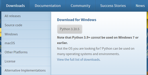

# Installation


In this section you’ll see how to install Python on [Windows](#install-python-on-windows), [macOS](#install-python-on-macos), [Linux](#install-python-on-linux), [Android](#install-python-on-android) and [iOS](#install-python-on-ios).

## Install Python on Windows
Since windows don’t come with Python preinstalled, it needs to be installed explicitly. Here we will define step by step tutorial on How to install Python on Windows. Follow the steps below :

### Download Python Latest Version from python.org
**Step 1:** First and foremost step is to open a browser and type [https://www.python.org/downloads/windows/](https://www.python.org/downloads/windows/)

**Step 2:** Underneath the **Python Releases for Windows** find the **Latest Python 3 Release – Python 3.10.5** (the latest stable release as of now is Python 3.10.5).



**Step 3:** On this page move to **Files** and click on **Windows x86-64 executable installer** for 64-bit or **Windows x86 executable installer** for 32-bit.


#### Here we are providing the installation process of Python 3.10.4 on Windows
- Run the Python Installer for how to install python on windows downloads folder
- Make sure to mark Add Python 3.10 to PATH otherwise you will have to do it explicitly. It will start installing python on windows.
- After installation is complete click on Close. Bingo..!! Python is installed.


To verify your python installation, open your command prompt and run:
```bash
python --version
```
If python was installed correctly, you should get an output like this
```bash
Python 3.10.4
```


## Install Python on Linux

Many linux distros have python preinstalled.
To install Python in your linux machine open up your terminal and install `python3` with your system package manager.

On my system (Debian) it's:
```bash
apt install python3
```
(Your package manager may vary depending on your system.)


## Install Python on MacOS
Python usually comes preinstalled in MacOS.

To install Python open your terminal and run:
```
brew install python3
```

## Install Python on Android

To install Python on Android first get the **Termux** app from [F-Droid](https://f-droid.org/en/packages/com.termux/) or [Github Builds](https://github.com/termux/termux-app/releases/tag/v0.118.0).

**Termux** is a commandline emulator for Android. You can use many linux packages inside Termux.

Open termux then run:
```
apt update && apt upgrade
```

Then install Python with:
```
apt install python
```

**NOTE:** Don't install Termux from Google Play Store. It's broken and no longer maintained!

## Install Python on IOS

To install Python on IOS get the **iSH** app from App Store.

**iSH** is a linux emulator for IOS. It runs a lightweight linux distro called Alpine Linux. So you can emulate anything inside it you could do on an Alpine Machine.

Open iSH then run:
```
apk update && apk upgrade
```

Then install Python with:
```
apk add python3
```

## Verify your Python Installation

To verify your python installation open your terminal app and run:
```bash
python3 --version
```

If everything was installed correctly you should see the version of your python installation.
